<h1 align="center"> Hello There I'm Aditya</h1>

AI Developer&nbsp; ·&nbsp; Security Researcher&nbsp; ·&nbsp; Open Source Contributor

<!--
  Widths chosen so the two panels render the SAME height (~417px) side by side:
  portrait avi-ascii.svg is 840x875 -> width 400; info card info-card.svg is
  540x548 -> width 411. If you edit the info card's size, re-match these.
  Both are self-hosted animated SVGs -- GitHub plays their SMIL/CSS animations
  when embedded as , so nothing 404s or gets rate-limited.
-->
<table align="center">
  <tr>
    <!-- <td valign="top"></td> -->
    <td valign="top"></td>
  </tr>
</table>

  

  <a href="https://adiii-dev.vercel.app/">Portfolio</a>
  &nbsp;·&nbsp;
  <a href="https://www.linkedin.com/in/aditya-j-458824313/">LinkedIn</a>
  &nbsp;·&nbsp;
  <a href="https://www.instagram.com/introver_dev_x0r.exe">Instagram</a>

